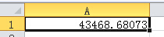
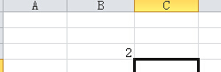
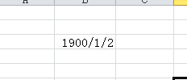
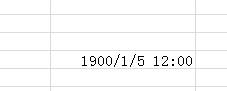
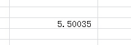
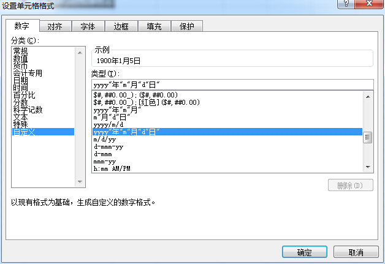
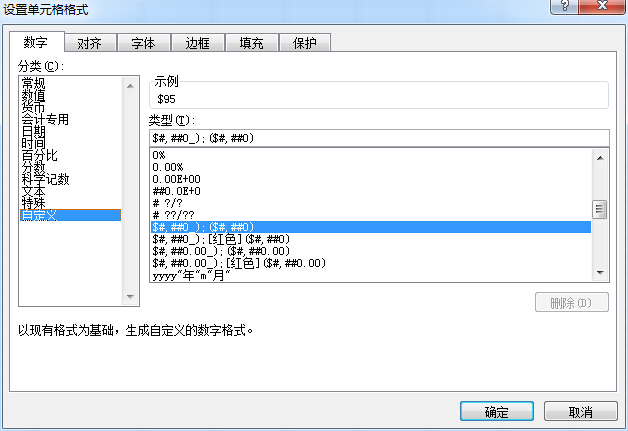

## 奇怪的数值

```java
try(Workbook wb = WorkbookFactory.create(true)){
    Sheet s = wb.createSheet("my sheet");
    Row r0 = s.createRow(0);
    Calendar c = Calendar.getInstance();
    c.set(2019, 0, 3, 16, 20, 15);
    c.set(Calendar.MILLISECOND, 0);
    r0.createCell(0).setCellValue(c.getTime());
    
    write(wb);
}catch(IOException e){
    e.printStackTrace();
}
```
以上代码为第一行的第一个单元格设置了2019-01-03 16:20:15.000(Calendar的1月为MONTH=0)的日期值，生成的效果如下图所示：


为什么生成的excel中单元格的值非但不是一个日期值，反而是一个很奇怪的数值？查看`org.apache.poi.xssf.usermodel.XSSFCell.setCellValue(Date)`源码：
```java
@Override
public void setCellValue(Date value) {
    if(value == null) {
        setCellType(CellType.BLANK);
        return;
    }

    boolean date1904 = getSheet().getWorkbook().isDate1904();
    setCellValue(DateUtil.getExcelDate(value, date1904));
}
```
最后一行中`DateUtil.getExcelDate(value, date1904)`返回的是一个double值，进入该方法：

```java
public static double getExcelDate(Date date, boolean use1904windowing) {
    Calendar calStart = LocaleUtil.getLocaleCalendar();
    calStart.setTime(date);   // If date includes hours, minutes, and seconds, set them to 0
    return internalGetExcelDate(calStart, use1904windowing);
}
```
前两行代码的作用是获取传入的时间值的Calendar对象，关键代码在最后一行的`internalGetExcelDate(Caldendar, boolean)`方法，进入该方法：
```java
private static double internalGetExcelDate(Calendar date, boolean use1904windowing) {
    // do check
    
    // Because of daylight time saving we cannot use
    //     date.getTime() - calStart.getTimeInMillis()
    // as the difference in milliseconds between 00:00 and 04:00
    // can be 3, 4 or 5 hours but Excel expects it to always
    // be 4 hours.
    // E.g. 2004-03-28 04:00 CEST - 2004-03-28 00:00 CET is 3 hours
    // and 2004-10-31 04:00 CET - 2004-10-31 00:00 CEST is 5 hours
    double fraction = (((date.get(Calendar.HOUR_OF_DAY) * 60
                         + date.get(Calendar.MINUTE)
                        ) * 60 + date.get(Calendar.SECOND)
                       ) * 1000 + date.get(Calendar.MILLISECOND)
                      ) / ( double ) DAY_MILLISECONDS;
    Calendar calStart = dayStart(date);

    double value = fraction + absoluteDay(calStart, use1904windowing);

    if (!use1904windowing && value >= 60) {
        value++;
    } else if (use1904windowing) {
        value--;
    }

    return value;
}
```

**fraction**变量由当前时间的毫秒数除以一天中总的毫秒数得到，正如变量名的中文含义**分数**，该变量实际标识了当前天在一天中占的比例，如上图生成的值的小数约为0.68073，即说明这一天走完了68%，根据16点相对于一天24个小时的比例可以推测该结果是正确的，实际值的计算公式为：

> (16 * 60 * 60 * 1000  + 20 * 60 * 1000 + 15 * 1000 ) / 86400000

计算结果：**0.68072916666**，该结果四舍五入后与生成的单元格中的值**0.68073**刚好吻合！


接下来是整数部分数值了，整数值为**43468**，该值是如何得到的呢？

```java
double value = fraction + absoluteDay(calStart, use1904windowing);
```

这句代码中的`absoluteDay(calStart, use1904windowing)`就是求解整数部分的值，通过方法名可知该方法求的是传入日期与某个日期值之前的差值，该方法源码如下：

```java
/**
 * Given a Calendar, return the number of days since 1900/12/31.
 *
 * @return days number of days since 1900/12/31
 * @param  cal the Calendar
 * @exception IllegalArgumentException if date is invalid
 */
protected static int absoluteDay(Calendar cal, boolean use1904windowing){
    return cal.get(Calendar.DAY_OF_YEAR)
           + daysInPriorYears(cal.get(Calendar.YEAR), use1904windowing);
}
```
请注意方法文档：该方法的返回值是从1900年12月31日到当前时间的天数，也就是从1900-12-31到2019-01-03的天数，我们可以使用网络上的日期计算器计算这两个日期之间的差值，也可以自己手写计算日期差值的函数，我们选择了手写该函数：

```java
public static int days(String from, String to) {
    DateFormat df = new SimpleDateFormat("yyyy-MM-dd");
    try {

        Calendar c1 = Calendar.getInstance();
        c1.setTime(df.parse(from));
        Calendar c2 = Calendar.getInstance();
        c2.setTime(df.parse(to));

        boolean lt = c1.getTimeInMillis() > c2.getTimeInMillis();
        Calendar fromCal = lt ? c2 : c1;
        Calendar toCal = lt ? c1 : c2;

        int total = 0;
        int fromYear = fromCal.get(Calendar.YEAR);
        int toYear = toCal.get(Calendar.YEAR);
        if (Math.abs(fromYear - toYear) > 1) {
            Calendar tmp = Calendar.getInstance();
            reset(tmp);
            for (int year = fromYear + 1; year < toYear; year++) {
                tmp.set(Calendar.YEAR, year);
                int dayOfYear = tmp.getActualMaximum(Calendar.DAY_OF_YEAR);
                total += dayOfYear;
            }
        }
        int fromYearDay = fromCal.get(Calendar.DAY_OF_YEAR);
        int toYearDay = toCal.get(Calendar.DAY_OF_YEAR);
        if (fromYear == toYear) { // 同一年
            total += Math.abs(toYearDay - fromYearDay);
        } else {
            total += (fromCal.getActualMaximum(Calendar.DAY_OF_YEAR) - fromYearDay + toYearDay);
        }

        return lt ? total : -1 * total;
    } catch (ParseException e) {
        e.printStackTrace();
    }

    return 0;
}

private static void reset(Calendar c) {
    c.set(Calendar.MONTH, 0);
    c.set(Calendar.DAY_OF_YEAR, 1);
    c.set(Calendar.HOUR, 0);
    c.set(Calendar.MINUTE, 0);
    c.set(Calendar.SECOND, 0);
    c.set(Calendar.MILLISECOND, 0);
}
```
调用该方法：`days("2019-01-03", "1900-12-31")`，得到的日期差值为：
> 43102

**为什么计算出来的值比整数部分的值43468少了366天？**

计算值比实际值少了一年零一天（1900年与2019年都不是闰年，只有365天），这一年的时间是从何而来？前面文档中已经说明了，整数部分的值是1900年12月31日到当前日期的天数之差，**但是，实际情况并不是像文档中描述的一样**，让我们看看DateUtil的absoluteDay实现：
```java
protected static int absoluteDay(Calendar cal, boolean use1904windowing){
    return cal.get(Calendar.DAY_OF_YEAR)
           + daysInPriorYears(cal.get(Calendar.YEAR), use1904windowing);
}
```
`cal.get(Calendar.DAY_OF_YEAR)`返回给定日期在该年的天数，再进入`daysInPriorYears(int, boolean)`方法：

```java
/**
 * Return the number of days in prior years since 1900
 *
 * @return    days  number of days in years prior to yr.
 * @param     yr    a year (1900 < yr < 4000)
 * @param use1904windowing
 * @exception IllegalArgumentException if year is outside of range.
 */

private static int daysInPriorYears(int yr, boolean use1904windowing){
    if ((!use1904windowing && yr < 1900) || (use1904windowing && yr < 1904)) {
        throw new IllegalArgumentException("'year' must be 1900 or greater");
    }

    int yr1  = yr - 1;
    int leapDays =   yr1 / 4   // plus julian leap days in prior years
                   - yr1 / 100 // minus prior century years
                   + yr1 / 400 // plus years divisible by 400
                   - 460;      // leap days in previous 1900 years

    return 365 * (yr - (use1904windowing ? 1904 : 1900)) + leapDays;
}
```
注意该方法的文档描述：
> Return the number of days in prior years since 1900

文档中指明了返回的天数从1900年开始，即1900年1月1日开始，而不是1900年12月31日（通过查询官网文档了解到：excel有两种日期系统，分别为1900年日期系统与1904年日期系统，两种日期系统的开始日期均为1月1日）。再看看实现：
```java
private static int daysInPriorYears(int yr, boolean use1904windowing){
	// ...
    int yr1  = yr - 1;
    int leapDays =   yr1 / 4   // plus julian leap days in prior years
                   - yr1 / 100 // minus prior century years
                   + yr1 / 400 // plus years divisible by 400
                   - 460;      // leap days in previous 1900 years

    return 365 * (yr - (use1904windowing ? 1904 : 1900)) + leapDays;
}
```
**yr**变量为传入的年份2019年，返回值`365 * (yr - (use1904windowing ? 1904 : 1900)) + leapDays`返回的是1900年到2019年之间的天数，而不是1901年（1900年12月31日可认为1900年已经过去），实际的年数为119年，而不是前面文档中希望得到的118年。因此可作出如下总结：
**两个方法文档的描述有差异，实际的实现是从1900年1月1日到当前日期。**


计算2019年1月1日到2019年1月3日的日期差值为43466，与实际值差了2天。首先，excel处理日期时是将前后日期都算上的，例如2019年1月1日到2019年1月3日之间的日期差值为3而不是2，因此天数差值为43467，这样一来比实际值只差一天了，再次查看`org.apache.poi.ss.usermodel.DateUtil.internalGetExcelDate(Calendar, boolean)`方法：
```java
private static double internalGetExcelDate(Calendar date, boolean use1904windowing) {
    // ...
    double fraction = (((date.get(Calendar.HOUR_OF_DAY) * 60
                         + date.get(Calendar.MINUTE)
                        ) * 60 + date.get(Calendar.SECOND)
                       ) * 1000 + date.get(Calendar.MILLISECOND)
                      ) / ( double ) DAY_MILLISECONDS;
    Calendar calStart = dayStart(date);

    double value = fraction + absoluteDay(calStart, use1904windowing);

    if (!use1904windowing && value >= 60) {
        value++;
    } else if (use1904windowing) {
        value--;
    }

    return value;
}
```
该方法的最后对value值做了一次自增操作，43467就变成43468了，这样，我们就知道这个**奇怪的数值**的来龙去脉了，尽管如此，对于日期值转换成的这个奇怪的数值我们仍然有以下困惑：

- 1900年有什么特殊含义？为什么得到的数值是1900年到给定日期的天数？
- 1904又有何特殊含义？什么时候需要使用1904作为起始年？什么时候需要使用1900年？
- 为什么对求得的数值进行了自增或自减操作？有什么特殊含义？


## 1900与1904？

1900与1904指的是Microsoft Excel中使用的日期系统，因为excel将所有的日期时间转换成**数值**进行存储，这样做就出现问题了：
> 什么样的日期转换为什么样的数值？他们的换算标准是什么？

日期系统就是来解决这个问题的，**excel默认使用1900日期系统**，该日期系统以1900年1月1日0时0分0秒为起始时间，如果要在excel中存储日期，需要将要存储的日期减去1900年1月1日0时0分0秒，得到的偏移量就是需要存储的日期对应的数值，这也就是**奇怪的数值**的来源了，这个数值的整数部分是当前日期相对1900年1月1日的天数偏移量，小数部分是当前日期相对于0时0分0秒的偏移量（比例）。

接下来，我们将使用excel来测试日期与数值之间的互相转换：

### 数值转日期
新建一个excel文档，在任一单元格中输入数值**2**，如下图所示：

然后在该单元格下右键**设置单元格格式**，在弹出的列表中选择**日期**类型，得到的结果如下图所示：


数值2被转换成了日期类型1900年1月2日，因为1900年1月1日往后偏移2天后的日期为1900年1月3日，由于这一天没有到来，因此未满一天的天数不算，最后得到的结果就是1900年1月2日了。

### 日期转数值
新建excel文档，选择一个单元格输入日期**1900-01-05 12:00:30**，如下图所示：

右键单元格**设置单元格格式**，在弹出的列表中选择**数值**类型，得到的结果如下图所示：


日期1900年1月5日12时0分30秒被转换成了数值5.50035，1900年1月5日相对于1900年1月1日的偏移量为4，但实际上5号这天已经开始了，所以日期便宜量需要再加一天。小数部分为0.5多一点，因为12点为一天中的一半，所以为0.5，而0.00035就是那30秒相对于一天的比例了。

### 数值与日期的区分方法
既然日期在excel中以数值类型存储，那么，怎样区分日期的数值类型和真正的数值类型呢？区分方法为使用**单元格格式**进行区分，日期数值类型与真正的数值类型的单元格格式是不同的，如下图所示的单元格我们很容易就能判断出这是一个日期类型的单元格：

再如下图所示的单元格我们也能很轻松地判断出这是一个货币类型：



## 基于数值存储的思想

你可能会想，为什么excel要将日期类型转换成数值类型进行存储？不仅是日期类型，**所有可以通过公式转换成数值的类型都应该作为数值类型来存储。**这么做的好处就是不用在数据类型维度扩展，而只是在数据的格式化方式维度扩展。如**30块钱**在格式化时，美国等使用美元的国家会使用**$30**的方法表示，而在中国则是使用**￥30**的方法表示。30还是那个30，只是表示方法不同而已，我们只需要不断地扩展**表示货币**的手段即可，而不是扩展更多的表示货币的数据类型！

再谈日期，编程语言中的日期往往都是以1970年1月1日的上午8点作为起始日期，我们使用Java语言进行验证：
```java
Calendar c = Calendar.getInstance();
c.set(1970, 0, 1, 8, 0, 0);
c.set(Calendar.MILLISECOND, 0);
System.out.println(c.getTimeInMillis());
```
控制台打印如下：
> 0

编程语言中的日期是以当前日期对于起始日期的毫秒差进行表示的，这与excel中将其换算成小数数值类型不同，但是其本质是相同的，都是基于数值存储的思想。


## poi中读取日期单元格的方法

我们已经知道日期在excel中作为数值进行存储，因此在获取单元格的内容时获取到的也必然是一个数值，上述内容中已经陈述过：区分日期数值与普通数值的方法是查看单元格的格式化方式是否为日期格式化方式，如果是则将该数值换算成日期（怎么换算去的怎么换算回来），而这些操作都无需我们手动处理，poi中的**DateUtil**类可以为我们完成上述工作：
```java
try (Workbook wb = WorkbookFactory.create(new File(getOutDir(), "formatCell.xlsx"))) {
    Sheet s = wb.getSheetAt(0);
    for(Row r : s){
        for(Cell c : r){
            if(c.getCellType() == CellType.NUMERIC){
                if(DateUtil.isCellDateFormatted(c)){
                    System.out.println(new SimpleDateFormat("yyyy-MM-dd HH:mm:ss").format(c.getDateCellValue()));
                }
            }
        }
    }
    
    write(wb);
} catch (IOException e) {
    e.printStackTrace();
}
```
通过***DateUtil.isCellDateFormatted(Cell)***方法可以判断单元格是否为日期类型，判断方法无非是判断单元格的格式字符串是否是与日期格式化相关（poi中使用多个正则表达式进行校验），通过**Cell.getDateCellValue()**方法可获取格式化后的日期对象。