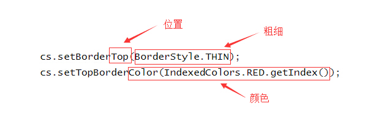

# poi-study


## 1. 创建WorkBook
```java
try (Workbook wb = new HSSFWorkbook()) {
	wb.write(new FileOutputStream("d:/1.xls"));
} catch (IOException e) {
	e.printStackTrace();
}

try (Workbook wb2 = new XSSFWorkbook()) {
	wb2.write(new FileOutputStream("d:/2.xlsx"));
} catch (IOException e) {
	e.printStackTrace();
}
```

**注**：创建的excel文件是无法打开的，因为一个sheet都没有。效果如下图所示：


## 2. 创建Sheet
```java
try (Workbook wb = new HSSFWorkbook()) {
    Sheet s1 = wb.createSheet();
    System.out.println("sheet name: " + s1.getSheetName());
    write(wb);
} catch (IOException e) {
    e.printStackTrace();
}
```
上述是最简单的创建sheet的例程，控制台打印如下：
> sheet name: Sheet0

默认以Sheet[Num]为名称，Num为当前的sheet的序号，从0开始。除此之外，还可以手动指定sheet名称，如：
```java
try (Workbook wb = new HSSFWorkbook()) {
    Sheet s1 = wb.createSheet("mySheet");
    System.out.println("sheet name: " + s1.getSheetName());
    write(wb);
} catch (IOException e) {
    e.printStackTrace();
}
```
>sheet name: mySheet

**注意**：并非所有字符都可以作为sheet name，如***sheet[1]***这样的名称就不允许作为sheet的名称，如果对非法字符不清楚或无法规避，则可使用下述的生成sheet name方法：

```java
try (Workbook wb = new HSSFWorkbook()) {
    wb.createSheet(WorkbookUtil.createSafeSheetName("sheet[1]"));  
    wb.createSheet(WorkbookUtil.createSafeSheetName("sheet*2", '-'));
    write(wb);
} catch (IOException e) {
    e.printStackTrace();
}
```
默认将以空格替换掉非法字符，如果需要自定义替换字符，则调用**WorkbookUtil**的重载方法*createSafeSheetName(sheetName, replaceChar)*


## 3. 创建Cell(单元格)
```java
try(Workbook wb = WorkbookFactory.create(false)){
    Sheet s = wb.createSheet("mySheet");
    Row r1 = s.createRow(1);
    Cell r1c0 = r1.createCell(0);
    r1c0.setCellValue("Hello, world!");
    
    Cell r1c1 = r1.createCell(1);
    r1c1.setCellValue(true);
    wb.write(new FileOutputStream("out/1.xls"));
}catch (IOException e) {
    e.printStackTrace();
}
```
单元格(Cell)对象由行(Row)对象持有，在创建单元格之前，先使用Sheet对象创建一个行，然后使用Row创建一个单元格，通过**setCellValue**方法设置单元格的值，可设置的类型有：
* **double**：数值类型，如1.25
* **boolean**：布尔类型，如true
* **String**：字符串类型，如"hi"
* **Calendar/Date**：日期类型
* **RichTextString**：富文本类型

直接使用**setCellValue(val)**方法设置单元格的值，各类型的表现如下图所示(office 2010)：


通过上图可以发现各类型的值在表现上有以下两个问题：
1. 横向对齐方式：数值类型的默认右对齐，布尔类型居中，字符串左对齐（**如果不指定类型，则默认使用org.apache.poi.ss.usermodel.HorizontalAlignment.GENERAL的对齐风格**）
2. 日期值显示错误：显示的日期值实际为数值，这是因为单元格没有进行数据格式化，接下来将演示如何创建一个日期类型的单元格
### 创建日期Cell
```java
try (Workbook wb = WorkbookFactory.create(false)) {
    Sheet s = wb.createSheet("mySheet");
    Row r1 = s.createRow(1);
    Cell r1c0 = r1.createCell(0);
    r1c0.setCellValue(new Date());

    CellStyle cs = wb.createCellStyle();
    cs.setDataFormat((short) BuiltinFormats.getBuiltinFormat("m/d/yy h:mm"));
    r1c0.setCellStyle(cs);
    write(wb);
} catch (IOException e) {
    e.printStackTrace();
}
```
对于日期类型这种特殊格式的字符串，需要设置单元格的样式，并将格式化的方法告知CellStyle对象，就可以将普通字符串格式化为特殊字符串了。
**关键代码**：

```java
CellStyle cs = wb.createCellStyle();
cs.setDataFormat((short) BuiltinFormats.getBuiltinFormat("m/d/yy h:mm"));
```

**BuiltinFormats.java中定义的格式化字符串：**

```java
private final static String[] _formats = {
        "General",
        "0",
        "0.00",
        "#,##0",
        "#,##0.00",
        "\"$\"#,##0_);(\"$\"#,##0)",
        "\"$\"#,##0_);[Red](\"$\"#,##0)",
        "\"$\"#,##0.00_);(\"$\"#,##0.00)",
        "\"$\"#,##0.00_);[Red](\"$\"#,##0.00)",
        "0%",
        "0.00%",
        "0.00E+00",
        "# ?/?",
        "# ??/??",
        "m/d/yy",
        "d-mmm-yy",
        "d-mmm",
        "mmm-yy",
        "h:mm AM/PM",
        "h:mm:ss AM/PM",
        "h:mm",
        "h:mm:ss",
        "m/d/yy h:mm",

        // 0x17 - 0x24 reserved for international and undocumented
        // TODO - one junit relies on these values which seems incorrect
        "reserved-0x17",
        "reserved-0x18",
        "reserved-0x19",
        "reserved-0x1A",
        "reserved-0x1B",
        "reserved-0x1C",
        "reserved-0x1D",
        "reserved-0x1E",
        "reserved-0x1F",
        "reserved-0x20",
        "reserved-0x21",
        "reserved-0x22",
        "reserved-0x23",
        "reserved-0x24",
        
        "#,##0_);(#,##0)",
        "#,##0_);[Red](#,##0)",
        "#,##0.00_);(#,##0.00)",
        "#,##0.00_);[Red](#,##0.00)",
		"_(* #,##0_);_(* (#,##0);_(* \"-\"_);_(@_)",
        "_(\"$\"* #,##0_);_(\"$\"* (#,##0);_(\"$\"* \"-\"_);_(@_)",
        "_(* #,##0.00_);_(* (#,##0.00);_(* \"-\"??_);_(@_)",
        "_(\"$\"* #,##0.00_);_(\"$\"* (#,##0.00);_(\"$\"* \"-\"??_);_(@_)",
        "mm:ss",
        "[h]:mm:ss",
        "mm:ss.0",
        "##0.0E+0",
        "@"
	};
```


## 4. 设置单元格格式


## 5. 单元格对齐
```java
try (Workbook wb = WorkbookFactory.create(false)) {
    Sheet s = wb.createSheet("mySheet");
    s.setDefaultColumnWidth(20);
    Row r0 = s.createRow(0);
    r0.setHeightInPoints(30f);
    Cell r0c0 = r0.createCell(0);
    r0c0.setCellValue("center text");
    CellStyle cs = wb.createCellStyle();
    cs.setAlignment(HorizontalAlignment.CENTER);
    cs.setVerticalAlignment(VerticalAlignment.CENTER);
    r0c0.setCellStyle(cs);
    write(wb);
} catch (IOException e) {
    e.printStackTrace();
}
```
以上代码设置单元格的水平、垂直对齐方式为居中对齐，该操作通过**CellStyle.setAlignment(HorizontalAlignment)**与**CellStyle.setVerticalAlignment(VerticalAlignment)**两个方法完成。

excel中，水平对齐有以下对齐方式：
1. 常规(General)：自动对齐，数字类型居右，字符串居左，布尔类型居中
2. 居左(Left)：靠左对齐，**可设置缩进**
3. 居中(Center)：居中对齐
4. 居右(Left)：靠右对齐，**可设置缩进**
5. 填充(Fill)：将内容在单元格的水平方向填充
6. 两端对齐(Justify)：除了最后一行，其它每行文本左右对齐（**注：没有试出效果**）
7. 跨列居中(Center selection)：与居中不同，跨列居中的单元格在单元格的宽度不够时，会跨越到其它列显示
8. 分散对齐(Distrubuted)：将单元格中的每个**词**均匀地分布在单元格中，单元格宽度改变，各个词之间的间隔动态变化

以上八中对齐方式在excel中的表现如下图：


垂直对齐方式：
1. 居上(Top)：内容贴近单元格顶部
2. 居中(Center)：内容在单元格垂直方向居中
3. 居下(Bottom)：内容贴近单元格底部
4. 两端对齐(Justify)：内容在垂直方向均匀分布
5. 分散对齐(Distrubuted)：与两端对齐效果相同

以上5中对齐方式在excel中的表现如下图：


## 6. 为单元格设置边框
```java
try(Workbook wb = WorkbookFactory.create(true)){
    Sheet s = wb.createSheet("my sheet");
    Row r = s.createRow(2);
    Cell c = r.createCell(5);
    r.setHeightInPoints(50f);
    c.setCellValue("hello");
    
    CellStyle cs = wb.createCellStyle();
    c.setCellStyle(cs);
    cs.setBorderTop(BorderStyle.THIN);
    cs.setTopBorderColor(IndexedColors.RED.getIndex());
    cs.setBorderRight(BorderStyle.MEDIUM_DASHED);
    cs.setRightBorderColor(IndexedColors.BLUE.getIndex());
    cs.setBorderBottom(BorderStyle.DOTTED);
    cs.setBottomBorderColor(IndexedColors.PINK.getIndex());
    cs.setBorderLeft(BorderStyle.DOUBLE);
    cs.setLeftBorderColor(IndexedColors.YELLOW.getIndex());
    
    write(wb);
}catch (IOException e) {
    e.printStackTrace();
}
```
边框的设置有三要素：位置(position)，粗细(width)，颜色(color)，poi中设置边框样式的示意图如下：



在excel中设置边框的方式如下所示：


可见，在excel中设置边框的选择更多样，可以设置斜的边框（严格意义上说这应该不算边框）。


## 7. 设置单元格背景
```java

```
## 8. 锁定sheet

### 8.1 什么是sheet的锁定？什么场景需要锁定sheet？
sheet锁定本质上是单元格的锁定，在某些特定场景下需要使得某些单元格无法被修改，这时就需要锁定sheet。


如上图为一个用户信息表，我们将此表分发给100个人，让这100个人填写自己的个人信息，然后我们通过程序将表格的内容提取并存储。
理想状态是这100个人都填写了正确的信息并保证表的完整性，但实际情况是这100个人中总会有那么几个喜欢恶作剧的人，于是，有人将表格改成了这个样子：


没错，手机号码列与性别列颠倒了过来，并且其前面还被加上了一个新的列（星座），此时如果我们拿着这个表的信息去导入必定会引发程序崩溃或信息无法导入的问题。为了解决这样的问题，我们可以将表格的某些单元锁定起来，不允许用户进行修改。锁定的步骤：
1. 选中表头的所有单元格，右键 - 设置单元格格式
2. 在设置界面中选择“保护”选项卡，勾选“锁定”项，确认操作
3. 在Excel中选择审阅，点击保护工作表，输入密码进行保护

锁定操作完成后，点击表头中的单元格进行修改操作，会出现以下提醒信息：


表头无法进行修改，用户只能在指定的区域（没有设置为锁定的单元格区域）内进行操作了。


### 8.2 poi中锁定sheet
```java
Sheet s = wb.createSheet("my sheet");
Cell c = s.createRow(3).createCell(3);
c.setCellValue("Hello");
CellStyle cs = wb.createCellStyle();
cs.setLocked(false);
c.setCellStyle(cs);
s.protectSheet("123");
```
以上代码中，我们通过CellStyle对象设置了单元格的锁定为false，然后对当前sheet进行了保护，也就是说只有(3, 3)这个单元格允许用户操作，其它的所有单元格将无法被操作（**因为单元格默认为锁定状态**）。

注：
1. 保护工作表只是sheet级别的，并不能将整个excel文档进行保护。
2. 保护的工作表也有可能是范围性保护，可以通过设置该工作表下的若干单元格为非锁定状态以达到不保护的目的。
3. 虽然有的单元格属于非锁定状态，在工作表被保护的情况下只能编辑其内容，而不能设置进行其它任何的设置操作（我们可以反推这个结论的合理性，假设被保护的工作表下非锁定单元格可以设定样式，那么我们为该单元格设置单元格格式，并设置其为锁定状态，此时单元格就不能进行编辑了，并且其永远恢复不到设置前的状态，这显然是不合理的）


## 9. 单元格合并
```java
Sheet s = wb.createSheet("my sheet");
Row r0 = s.createRow(0);
r0.createCell(0).setCellValue("基本信息");
Row r1 = s.createRow(1);
r1.createCell(0).setCellValue("姓名");
r1.createCell(1).setCellValue("性别");
r1.createCell(2).setCellValue("年龄");
r1.createCell(3).setCellValue("联系电话");
r1.createCell(4).setCellValue("地址");

s.addMergedRegion(new CellRangeAddress(0, 0, 0, 4));
// 将单元格居中
CellStyle cs = wb.createCellStyle();
cs.setAlignment(HorizontalAlignment.CENTER);
r0.getCell(0).setCellStyle(cs);
```

以上代码演示了一个简单的单元格合并案例，`s.addMergeRegion(CellRangeAddress)`设置合并的区域从第0行到第0行，从第0列到第4列，于是，第一行的第1到5列被合并在了一起，合并后的效果如下图所示：


对以上合并的代码及结果我们提出以下两个问题：
1. 为什么单元格的合并操作发生在Sheet对象上？如何推出该结果？
2. 合并后的单元格读取时是什么样的结构？

对于问题1我们可以通过分析推出调用对象与方法，而不是急于查找相关API。思考过程如下：
我们经常作合并单元格的操作，不同的是以往我们是通过可视化界面进行操作，而非程序。既然我们曾经都做过单元格合并的操作，那么接下来的思考就会变得更加顺畅。首先，单元格合并是相对于多个单元格而言的，因此自然不存在合并的操作发生在单元格（Cell）对象本身。那么是发生在行（Row）对象上吗？不是。因为单元格的合并是可以跨行与跨列的，因此一个Row对象无法理解单元格的合并。再往上就是工作表（Sheet）对象了，由于Sheet对象持有所有的Row与Cell，所以其可以完成合并单元格的操作。那么，有没有可能是Sheet的上一级Workbook对象呢？显然也不是，单元格的合并是针对一个工作表的，当然没有理由说可以将不同工作表中的单元格合并。

至于问题2，我们当然也是先推理出一个结果，然后进行验证（**即便推理出的结果是对的，也需要**）。
首先，让我们想一想html的table元素下的单元格合并：

```html
<table>
	<tr>
		<td colspan="5">基本信息</td>
	</tr>
	<tr>
		<td>姓名</td>
		<td>性别</td>
		<td>年龄</td>
		<td>联系电话</td>
		<td>地址</td>
	</tr>
</table>
```

html的代码很直观，我们可以清晰的看到表格拥有两行，第一行的单元格声明了其要占5个列单元，而第二行则每个单元格各占一个格子，于是就形成了单元格合并的局面。
看了以上代码，相信不难猜出合并单元格读取的结果：
**第一行实际只有一个单元格，因此只有一个基本信息被读取到，其它列不存在，并且，基本信息在第一列**

接下来，我们通过代码进行验证：
```java
Sheet s = wb.getSheetAt(wb.getActiveSheetIndex());
for (Row r : s) {
    for (int i = r.getFirstCellNum(); i < r.getLastCellNum(); i++) {
        System.out.print(r.getCell(i).getStringCellValue() + ", ");
    }
    System.out.println();
}
```
打印结果：
```
基本信息, 
姓名, 性别, 年龄, 联系电话, 地址, 
```

一切如我们所料。接下来我们再分析一下这种做法的合理性，从逻辑上分析，第一行就是只有一列，难道你看到了两列甚至更多列吗？没有。只是我们的看到的这一列相较于其它列比较**宽**而已，因此它没有特殊性。所以，合并单元格总是以左上角（注意：这个左上角指的是相对所有由内容的单元格的左上角，也就是从左边往右边看最上方有内容的单元格）的单元格的内容为准，如果合并的单元格里有与左上角单元格不同内容的单元格，那么可能会有两个操作：
1. 删除那些与左上角内容不同的单元格，取消合并时只留下当初的最左上角的内容
2. 不删除其它单元格的内容并进行合并，在视觉上只能看到最左上角的单元格的内容

经过测试发现，Excel中采取的是第一种做法，在合并不同内容的单元格时会弹出提示是否删除不同内容：


而poi中采取的是第二种做法，仍然保留原有单元格的内容。上述例子中，我们在第二行写入一个其它内容的单元格，然后把合并区域扩展到第二行，使用poi进行读取时的结果如下所示：
```
基本信息, 
hahah, 
姓名, 性别, 年龄, 联系电话, 地址, 
```


## 10. 页眉与页脚

### 10.1 页眉与页脚的作用
页眉与页脚在


