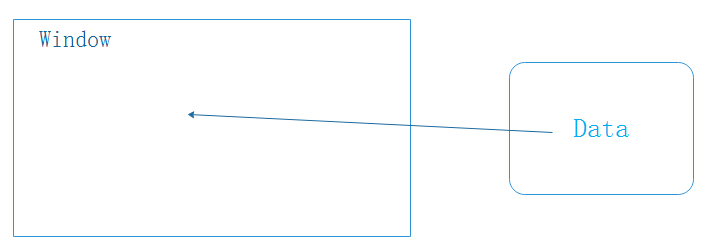

## 拆分操作与MVC模式

Excel的拆分操作将当前窗口拆分为几个窗口，然后在窗口中显示了相同的数据。并且，对任何一个窗口进行数据的修改操作最终会反映到其它窗口中，因为它们持有的是同一份数据。

当我们打开一个excel表格时，它的显示与存储关系如下图所示：



如果表格被拆分为两个窗口，则显示与存储的关系变为了如下图所示：


视窗中不存储数据，只是引用数据，并且两个视窗中引用了同一份数据。如果在某个视窗中修改数据，则会修改引用的内存中的数据，**修改完成后触发视图的渲染操作**，此时两个视窗中的数据由于还是内存中的那一份数据，所以它们看起来是一致的。


我们使用Java模拟以上过程：

**Data**：该对象持有Excel表中所有数据，为了演示方便，只操作一行数据

```java
public class Data {

    private List<Object> datas = new ArrayList<Object>();
    
    public void add(Object o){
        datas.add(o);
    }
    
    public List<Object> get(){
        return datas;
    }

    @Override
    public String toString() {
        return datas.toString();
    }
    
}
```

**View**：视图接口，每个视图都有渲染操作，在Excel中渲染操作就是告诉操作系统如何将表格画到屏幕上

```java
public interface View {

    void render();
    
}
```

**AbstractWindow**：抽象视图类，一个视图占据一个矩形的空间（即便是圆形、三角形也是占据一个矩形空间）并且持有数据对象
注：通过(left, top) (right, bottom)可确定视图占据的空间

```java
public abstract class AbstractWindow implements View {

    protected Data data;
    protected int left;
    protected int top;
    protected int right;
    protected int bottom;

    public AbstractWindow(Data data) {
        this.data = data;
    }

    public AbstractWindow(Data data, int left, int top, int right, int bottom) {
        super();
        this.data = data;
        this.left = left;
        this.top = top;
        this.right = right;
        this.bottom = bottom;
    }

    public int getLeft() {
        return left;
    }

    public void setLeft(int left) {
        this.left = left;
    }

    public int getTop() {
        return top;
    }

    public void setTop(int top) {
        this.top = top;
    }

    public int getRight() {
        return right;
    }

    public void setRight(int right) {
        this.right = right;
    }

    public int getBottom() {
        return bottom;
    }

    public void setBottom(int bottom) {
        this.bottom = bottom;
    }
}
```

**Window**：视窗对象，对应了打开Excel文件后看到的窗口
注：这里的视窗对象是一个矩形，它的渲染方法告知在屏幕的什么区域内绘制什么内容

```java
public class Window extends AbstractWindow {

    public Window(Data data) {
        super(data);
    }

    public Window(Data data, int left, int top, int right, int bottom) {
        super(data, left, top, right, bottom);
    }

    @Override
    public void render() {
        System.out.println("在(" + left + ", " + top + ")到(" + right + ", " + bottom + ")的区域内显示：");
        System.out.println(data.toString());
    }

}
```

接下来，我们就用这个视窗来显示一些内容吧：
```java
public static void main(String[] args) {
    Data d = new Data();
    for(int i=1;i<=10;i++){
        d.add(i);
    }
        
    View v = new Window(d, 0, 0, 100, 100);
    v.render();
}
```
我们为视图添加了10个整数数据，并且指定视图的绘图区域为(0, 0) -> (100, 100)，调用渲染方法，得到以下结果：
```
在(0, 0)到(100, 100)的区域内显示：
[1, 2, 3, 4, 5, 6, 7, 8, 9, 10]
```

我们已经能将数据展示到一个视窗中了，但是现在有人提出了窗口拆分的需求，要将一个窗口拆分为多个窗口进行显示以方便进行数据对比。


接下来，我们继续扩展我们的视图类，因为拆分窗口后一个窗口将变成多个窗口，但是按照面向对象的思想，这个多个窗口的窗口仍然是一个完整的对象，我们暂且为其命名为**MutipleWindow**吧。看看这个MutipleWindow类：

```java
public class MultipleWindow extends AbstractWindow{
    
    private List<Window> wins = new ArrayList<Window>();
    
    public MultipleWindow(Data data, Window... wins) {
        super(data);
        if(wins == null){
            throw new IllegalArgumentException("必须传入至少一个Window对象！");
        }
        for(Window win : wins){
            win.data = data;
            this.wins.add(win);
        }
    }
    
    @Override
    public void render() {
        for(Window win : wins){
            win.render();
        }
    }
}
```

**MutipleWindow**类的构造非常简洁，它持有了多个**Window对象**，在渲染时，它会同时将多个Window对象渲染到屏幕，这正是我们想要的效果。接下来，让我们拆分刚才的窗口吧：

```java
public static void main(String[] args) {
    Data d = new Data();
    for(int i=1;i<=10;i++){
        d.add(i);
    }
    
    Window v1 = new Window(d, 0, 0, 50, 100);
    Window v2 = new Window(d, 51, 0, 100, 100);
    View v = new MultipleWindow(d, v1,v2);
    v.render();
}
```
拆分后的视图渲染结果如下：
```
在(0, 0)到(50, 100)的区域内显示：
[1, 2, 3, 4, 5, 6, 7, 8, 9, 10]
在(51, 0)到(100, 100)的区域内显示：
[1, 2, 3, 4, 5, 6, 7, 8, 9, 10]
```

新的拆分视图已经能够在不同的区域内绘制相同内容了，接下来，我们再模拟数据的修改操作：
```java
public static void main(String[] args) {
    Data d = new Data();
    for(int i=1;i<=10;i++){
        d.add(i);
    }
    
    Window v1 = new Window(d, 0, 0, 50, 100);
    Window v2 = new Window(d, 51, 0, 100, 100);
    View v = new MultipleWindow(d, v1,v2);
    v.render();
    
    System.out.println("============ 修改数据 ================");
    
    List<Object> line = d.get();
    Object o = line.set(3, "hello");
    line.remove(o);
    v.render();
}
```
以上代码中，我们修改索引位置为3的数据为"hello"字符串，然后重新渲染了视图，得到的效果如下所示：
```
在(0, 0)到(50, 100)的区域内显示：
[1, 2, 3, 4, 5, 6, 7, 8, 9, 10]
在(51, 0)到(100, 100)的区域内显示：
[1, 2, 3, 4, 5, 6, 7, 8, 9, 10]
============ 修改数据 ================
在(0, 0)到(50, 100)的区域内显示：
[1, 2, 3, hello, 5, 6, 7, 8, 9, 10]
在(51, 0)到(100, 100)的区域内显示：
[1, 2, 3, hello, 5, 6, 7, 8, 9, 10]

```

可以看到，两个分视图同时显示了修改后的数据，这也验证了我们对于Excel中拆分视图设计的理解。


**总结**：MVC设计模式的思想是将数据与显示分离，同一份数据在不同的视图下有不同的表现，这样做的好处是降低了数据与视图的耦合性，也使得视图在扩展时更加方便。